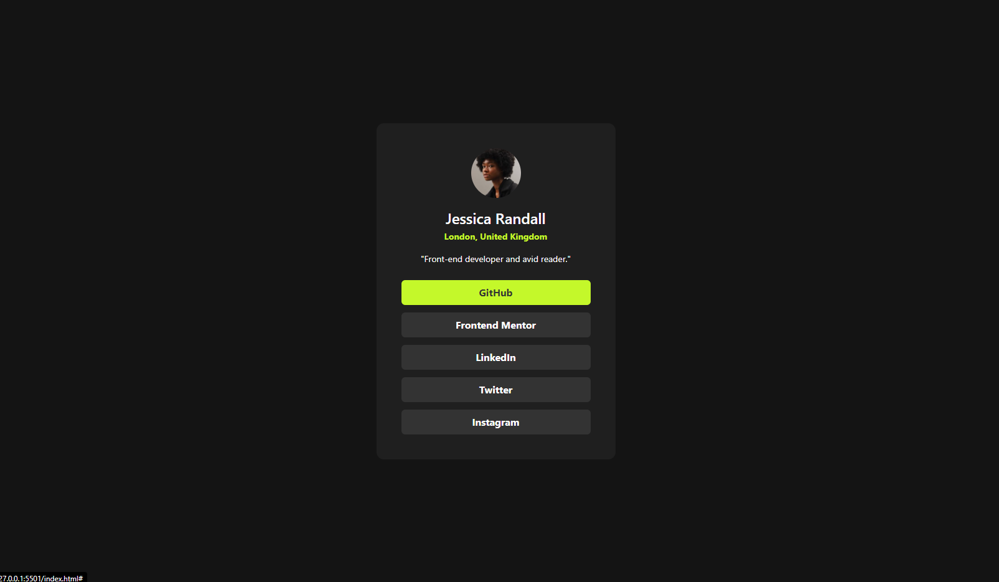

# Frontend Mentor - Social links profile solution

This is a solution to the [Social links profile challenge on Frontend Mentor](https://www.frontendmentor.io/challenges/social-links-profile-UG32l9m6dQ). Frontend Mentor challenges help you improve your coding skills by building realistic projects. 

## Table of contents

- [Overview](#overview)
  - [The challenge](#the-challenge)
  - [Screenshot](#screenshot)
  - [Links](#links)
- [My process](#my-process)
  - [Built with](#built-with)
  - [What I learned](#what-i-learned)

## Overview

### The challenge

Users should be able to:

- See hover and focus states for all interactive elements on the page

### Screenshot

#### Desktop

#### Mobile

### Links

- Solution URL: [Web](https://jazzielp.github.io/tw-social-links-profil/)
- Live Site URL: [GitHub](https://github.com/jazzielp/tw-social-links-profil/)

## My process

### Built with

- Semantic HTML5 markup
- Mobile-first workflow
- [Tailwind](https://tailwindcss.com/) - TailwindCSS

### What I learned
I'm still learning about Tailwind syntax

